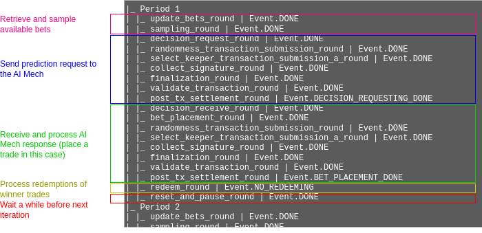
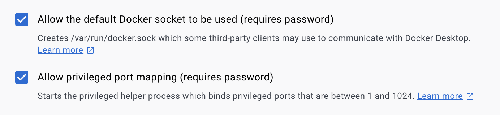

# Supafund Quickstart

Supafund quickstart 用于在本地快速启动 Supafund 预测代理。以下步骤默认在 `quickstart/` 目录下执行。

## 环境要求

- Python `== 3.10`
- [Poetry](https://python-poetry.org/docs/) `>= 1.8.3`
- Docker & Docker Compose

## 如何运行

```bash
poetry install
poetry run ./start_supafund.sh
```

脚本会载入 `configs/config_supafund.json`，初始化 `.operate/` 工作目录并启动所有所需容器。Supafund UI 默认暴露在 `http://localhost:8716`。

### 常用命令

```bash
# 停止服务
poetry run ./stop_service.sh configs/config_supafund.json

# 重置交互式配置
poetry run ./reset_configs.sh configs/config_supafund.json

# 查看健康状态
poetry run ./check_service_status.sh configs/config_supafund.json
```

### 可选环境变量

```bash
export SUPAFUND_API_ENDPOINT="https://api.supafund.xyz"
export SUPAFUND_WEIGHTS='{"founder_team":20,"market_opportunity":20,"technical_analysis":20,"social_sentiment":20,"tokenomics":20}'
export MIN_EDGE_THRESHOLD=5
export RISK_TOLERANCE=5
```

如未设置，脚本会在启动时提示输入。

## 调试与排查

- **查看实时日志**

  ```bash
  docker logs $(docker ps --filter "name=supafund" --format "{{.Names}}" | head -n 1) --follow
  ```

- **分析代理状态机**

  ```bash
  poetry run ./analyse_logs.sh configs/config_supafund.json --agent=aea_0 --fsm
  ```

- **更多文档**

  - `SUPAFUND_SETUP.md`：Supafund 代理配置与启动流程。
  - `TROUBLESHOOTING_REPORT.md`：常见问题汇总。

```bash
./analyse_logs.sh <agent_config.json> --agent=aea_0 --reset-db --fsm
```

This will output the different state transitions of your agent per period, for example:



For more options on the above command run:

```bash
./analyse_logs.sh --help
```

or take a look at the [command documentation](https://docs.autonolas.network/open-autonomy/advanced_reference/commands/autonomy_analyse/#autonomy-analyse-logs).

To stop your agent, use:

```bash
./stop_service.sh <agent_config.json>
```

### Changing entered configuration

If you entered any input when running an agent for the first time, and later want to change them, use the following script:

```bash
./reset_configs.sh <agent_config.json>
```

### Claim accrued OLAS staking rewards

If your service is staked, you can claim accrued OLAS staking rewards through the script

```bash
./claim_staking_rewards.sh <agent_config.json>
```

The accrued OLAS will be transferred to your service Safe without having to unstake your service.

### Backups

Agent runners are recommended to create a [backup](#backup-and-recovery) of the relevant secret key material.

### Skip user prompts

You can optionally pass `--attended=false` to skip asking for inputs from the user. Note that, in this mode appropriate environment variables must be set.

## Update between versions

Simply pull the latest script:

```bash
git pull origin
```

Then continue above with [Run the script](https://github.com/valory-xyz/quickstart?tab=readme-ov-file#run-the-service).

## Change the password of your key files

> :warning: **Warning** <br />
> The code within this repository is provided without any warranties. It is important to note that the code has not been audited for potential security vulnerabilities.
>
> If you are updating the password for your key files, it is strongly advised to [create a backup](#backup-and-recovery) of the old configuration (located in the `./.operate` folder) before proceeding. This backup should be retained until you can verify that the changes are functioning as expected. For instance, run the service multiple times to ensure there are no issues with the new password before discarding the backup.

If you have started your script specifying a password to protect your key files, you can change it by running the following command:

```bash
./reset_password.sh
```

This will change the password in the following files:

- `.operate/user.json`
- `.operate/wallets/ethereum.txt`

## Advice for Mac users

In Docker Desktop make sure that in `Settings -> Advanced` the following boxes are ticked



## Advice for Windows users using Git BASH

We provide some hints to have your Windows system ready to run the agent. The instructions below have been tested in Windows 11.

Execute the following steps in a PowerShell terminal:

1. Install [Git](https://git-scm.com/download/win) and Git Bash:

    ```bash
    winget install --id Git.Git -e --source winget
    ```

2. Install Python 3.10:

    ```bash
    winget install Python.Python.3.10
    ```

3. Close and re-open the PowerShell terminal.

4. Install [Poetry](https://python-poetry.org/docs/):

    ```bash
    curl.exe -sSL https://install.python-poetry.org | python -
    ```

5. Add Poetry to your user's path:

    ```bash
    $existingUserPath = (Get-Item -Path HKCU:\Environment).GetValue("PATH", $null, "DoNotExpandEnvironmentNames")

    $newUserPath = "$existingUserPath;$Env:APPDATA\Python\Scripts"

    [System.Environment]::SetEnvironmentVariable("Path", $newUserPath, "User")
    ```

6. Install [Docker Desktop](https://www.docker.com/products/docker-desktop/):

    ```bash
    winget install -e --id Docker.DockerDesktop
    ```

7. Log out of your Windows session and then log back in.

8. Open [Docker Desktop](https://www.docker.com/products/docker-desktop/) and leave it opened in the background.

Now, open a Git Bash terminal and follow the instructions in the "[Run the script](#run-the-script)" section as well as the subsequent sections. You might need to install Microsoft Visual C++ 14.0 or greater.

## Backup and Recovery

When executed for the first time, the `run_service.sh` script creates a number of blockchain accounts:

- one Master EOA account will be used to pay gas fees on behalf of the agent operator,
- one Master [Safe](https://app.safe.global/), multisig owned by the Master EOA (and a backup wallet, if provided) to handle the funds and interact with the OLAS protocol,
- one Agent EOA account will be used for the agent, and
- one smart contract account corresponds to a [Safe](https://app.safe.global/) wallet with a single owner (the agent account).

The addresses and private keys of the EOA accounts (plus some additional configuration) are stored within the folder `.operate`. In order to avoid losing your assets, back up this folder in a safe place, and do not publish or share its contents with unauthorized parties.

You can gain access to the assets of your service as follows:

1. Ensure that your service is stopped by running `stop_service.sh`.
2. Ensure that you have a hot wallet (e.g., [MetaMask](https://metamask.io/)) installed and set up in your browser.
3. Import the Master EOA account using the private keystore file. In MetaMask, Open Accounts drop-down &#8594; select "Add account or hardware wallet" &#8594; "Private Key" &#8594; "Select Type: JSON File", choose the private keystore file of the Master EOA account (located in `.operate/wallets/ethereum.txt`), and enter the same password you use when running the quickstart scripts:

<video src="https://github.com/user-attachments/assets/698ec86e-8dc5-4e25-8f0b-62c8a19a80f5" controls loop>Import Master EOA</video>

Now, you have full access through the hot wallet to the Master EOA and you can transfer their assets to any other address. You can also manage the assets of the Master Safe through the DApp https://app.safe.global/, using the address located in the file `.operate/wallets/ethereum.json`.

To access the Agent EOA account, you can import it into your hot wallet in a similar way, using the private keys found in the files in `.operate/keys`. This time you'll need to open the Accounts drop-down in Metamask &#8594; select "Add account or hardware wallet" &#8594; "Private Key" &#8594; "Select Type: Private Key", then open those `.operate/keys` files with a text editor, copy the private key, and paste it into the Metamask private key text field. Then you can manage the agent's assets in the service Safe through the DApp https://app.safe.global/, using the address located in the file `.operate/services/sc-.../config.json` against the `"multisig"` field.

## Terminate your on-chain service

If you wish to terminate your on-chain service (and receive back the staking/bonding funds to your owner/operator address in case your service is staked) execute:

```bash
./stop_service.sh <agent_config.json>
./terminate_on_chain_service.sh <agent_config.json>
```

## RPC-related Error Messages

When updating the service, you may need to re-run the script if you obtain any of the following error messages:

```Error: Service terminatation failed with following error; ChainTimeoutError(Timed out when waiting for transaction to go through)

Error: Service unbonding failed with following error; ChainTimeoutError(Timed out when waiting for transaction to go through)

Error: Component mint failed with following error; ChainTimeoutError(Timed out when waiting for transaction to go through)

Error: Service activation failed with following error; ChainTimeoutError(Timed out when waiting for transaction to go through)

Error: Service deployment failed with following error; ChainTimeoutError(Timed out when waiting for transaction to go through)

Error: Service terminatation failed with following error; ChainInteractionError({'code': -32010, 'message': 'AlreadyKnown'})
```

## Build deployments without executing the service

The script builds both a Docker Compose deployment (on `.operate.optimus/services/sc-*/deployment`) 
and a Kubernetes deployment (on `.operate.optimus/services/sc-*/deployment/abci_build_k8s`). 
Then, by default, the script will launch the local Docker Compose deployment. 
If you just want to build the deployment without executing the service 
(for example, if you are deploying to a custom Kubernetes cluster), then execute the script as:

```bash
./run_service.sh <agent_config.json> --build-only
```

## Guide for the service `config.json`

This is the configuration file whose path is passed as an argument to the `./run_service.sh` and other commands.
If you ever want to modify the config.json or create one of your own, follow this guide.
The JSON file should have the following schema:

### Top-level Fields

| Field Name      | Type                | Description                                                                             |
|-----------------|---------------------|-----------------------------------------------------------------------------------------|
| name            | string              | Name of the agent/service. This name is used for caching, so don't modify it afterwards.|
| hash            | string              | IPFS hash of the service package.                                                       |
| description     | string              | Description of the agent/service.                                                       |
| image           | string              | URL to an image representing the agent.                                                 |
| service_version | string              | Version of the service.                                                                 |
| home_chain      | string              | Name of the home blockchain network.                                                    |
| configurations  | object              | Chain-specific configuration. See table below.                                          |
| env_variables   | object              | Environment variables to be set for the agent. See table below.                         |

---

#### `configurations` Object

| Field Name      | Type    | Description                                                                                   |
|-----------------|---------|-----------------------------------------------------------------------------------------------|
| [chain name]    | object  | Keyed by chain name (e.g., "gnosis"). Contains agent configuration for that chain. See below. |

##### Example: `configurations.gnosis`

| Field Name           | Type    | Description                                                                     |
|----------------------|---------|---------------------------------------------------------------------------------|
| agent_id             | integer | Agent ID of the registered agent package in OLAS registry.                      |
| nft                  | string  | IPFS hash of the image of the NFT of this agent.                                |
| threshold            | integer | It is deprecated now and will be removed in the future. Leave it `1` for now.   |
| use_mech_marketplace | bool    | It is deprecated now and will be removed in the future. Leave it `true` for now.|
| fund_requirements    | object  | Funding requirements for agent and safe. See table below.                       |

###### `fund_requirements` Object

| Field Name (Token Address) | Type     | Description                                         |
|----------------------------|----------|-----------------------------------------------------|
| agent                      | number   | Amount required for the agent (in wei).             |
| safe                       | number   | Amount required for the safe (in wei).              |

> Token address is `0x0000000000000000000000000000000000000000` for native currency like ETH, xDAI, etc.
---

#### `env_variables` Object

| Field Name                  | Type    | Description                                                                                   |
|-----------------------------|---------|-----------------------------------------------------------------------------------------------|
| [variable name]             | object  | Keyed by variable name. Contains details for each environment variable. See below.            |

##### Example: `env_variables.GNOSIS_LEDGER_RPC`

| Field Name      | Type    | Description                                                      |
|-----------------|---------|------------------------------------------------------------------|
| name            | string  | Human-readable name of the variable.                             |
| description     | string  | Description of the variable.                                     |
| value           | string  | Default or user-provided value.                                  |
| provision_type  | string  | How the variable is provided: "user", "computed", or "fixed".    |

What happens when the `provision_type` is:
- `user` - The quickstart will ask for this value from CLI at runtime, and save it to avoid asking again.
- `fixed` - The `value` written in the config.json will be provided to the agent's environment variable, as is.
- `computed` - These are for special environment variables that the quickstart will set for you, based on other configurations like staking program, priority mech, etc.
